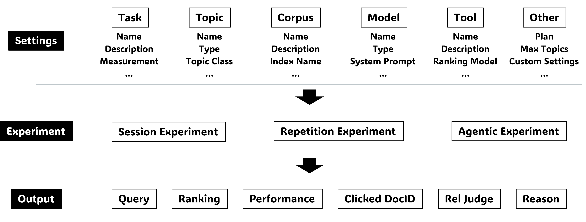
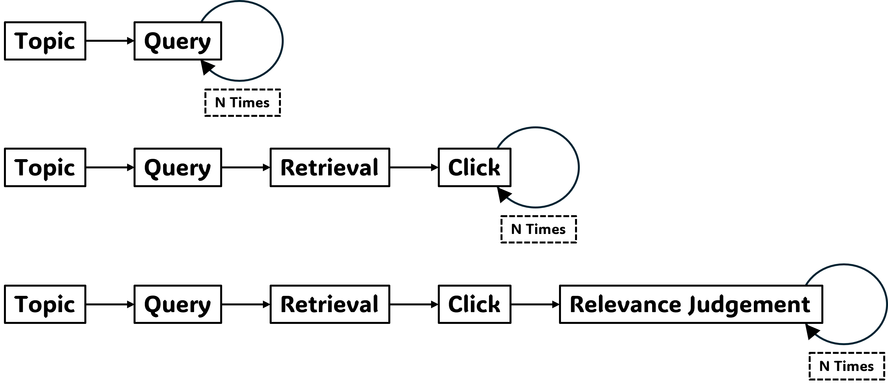

---
hide:
    - toc
---

# Understanding experimental settings of geniie-lab

!!! info "Overview"

    

!!! abstract "Common Settings (Read this first)"

    [Documentation for common settings](https://github.com/geniie-lab/geniie-lab/blob/main/docs/experiments/common_settings.md)

!!! example "Experiment Types"

    === "Session Experiment"

        

        - [Documentation for the settings of session experiments](https://github.com/geniie-lab/geniie-lab/blob/main/docs/experiments/session_experiment.md)
        - [Script to run a session experiment](https://github.com/geniie-lab/geniie-lab/blob/main/scripts/run_session_experiment.py)

    === "Repetition Experiment"

        

        - [Documentation for the settings of repetition experiments](https://github.com/geniie-lab/geniie-lab/blob/main/docs/experiments/repetition_experiment.md)
        - [Script to run a repetition experiment](https://github.com/geniie-lab/geniie-lab/blob/main/scripts/run_repetition_experiment.py)

    === "Agentic Experiment"

        

        - [Documentation for the settings of agentic experiments](https://github.com/geniie-lab/geniie-lab/blob/main/docs/experiments/agentic_experiment.md)
        - [Script to run an agentic experiment](https://github.com/geniie-lab/geniie-lab/blob/main/scripts/run_agentic_experiment.py)
