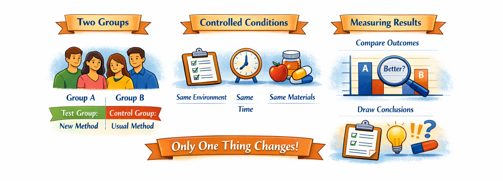

---
hide:
    - toc
---

# Controlled Experiment

> Kelly, D. Methods for evaluating interactive information retrieval systems with users. Foundations and Trends in Information Retrieval, 2009, 3(1-2): 1-224.