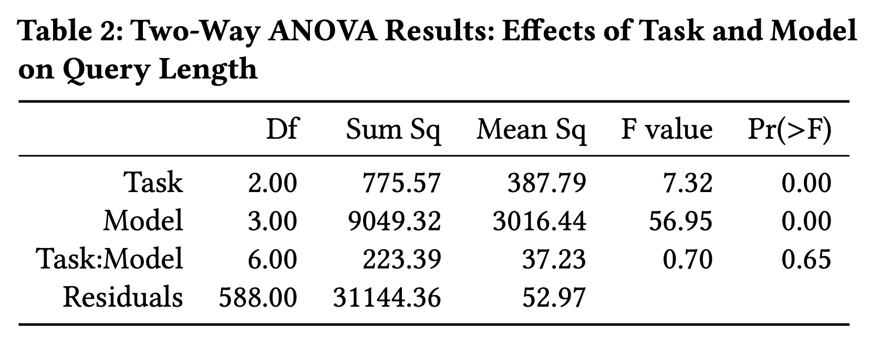
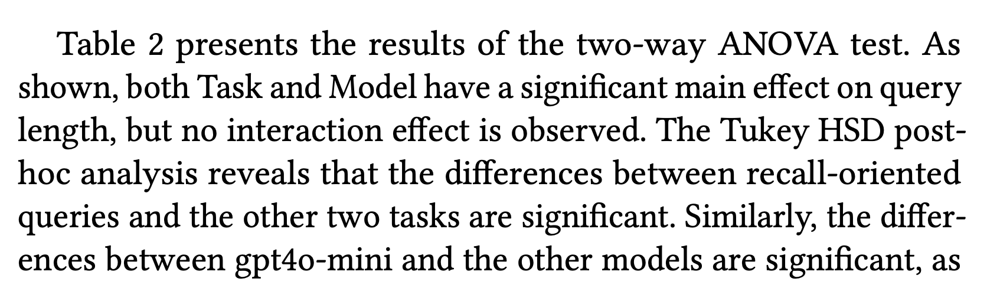
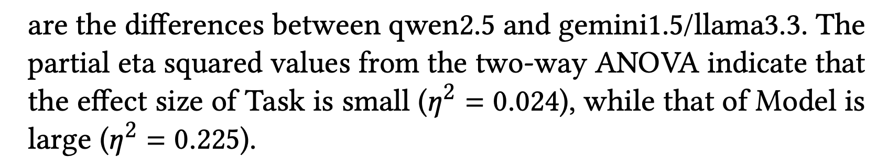

---
hide:
    - toc
---

# Data Analysis

:bulb: See [Sakai (2018)](references.md) for a comprehensive discussion on this topic.

## Descriptive Statistics

{ width=80% }

## Statistical Testing

{ width=80% }

## Effect Size

{ width=80% }
{ width=80% }

> Hideo Joho and Joemon M Jose. 2025. An Instruction-Response Perspective on Large Language Models in Information Retrieval Tasks. In Proceedings of the 48th International ACM SIGIR Conference on Research and Development in Information Retrieval (SIGIR '25), 3843–3852. [https://doi.org/10.1145/3726302.3730346](https://doi.org/10.1145/3726302.3730346)