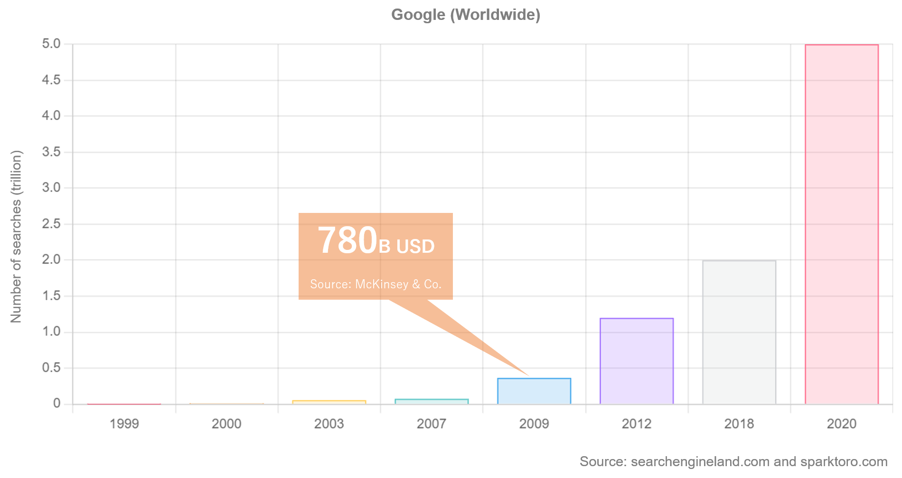
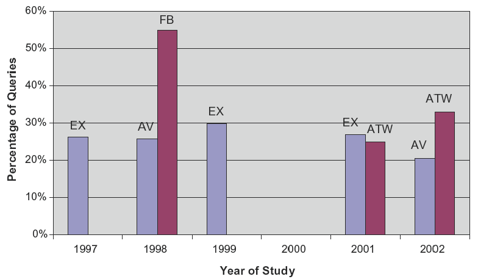
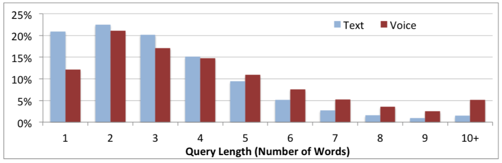
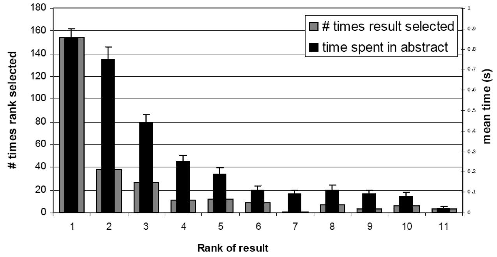

---
hide:
    - toc
---

# Human Search Behaviour on the Web

## Query Volume

### Query Volume in ChatGPT

## Query Length

> Bernard J. Jansen, Amanda Spink, and Tefko Saracevic. 2000. Real life, real users, and real needs: a study and analysis of user queries on the web. Inf. Process. Manage. 36, 2 (January 2000), 207-227. [http://dx.doi.org/10.1016/S0306-4573(99)00056-4](http://dx.doi.org/10.1016/S0306-4573(99)00056-4)

> Ido Guy. 2016. Searching by Talking: Analysis of Voice Queries on Mobile Web Search. In Proceedings of the 39th International ACM SIGIR conference on Research and Development in Information Retrieval (SIGIR '16). ACM, New York, NY, USA, 35-44. [https://doi.org/10.1145/2911451.2911525](https://doi.org/10.1145/2911451.2911525)

## Document Selection

> Laura A. Granka, Thorsten Joachims, and Geri Gay. 2004. Eye-tracking analysis of user behavior in WWW search. In Proceedings of the 27th annual international ACM SIGIR conference on Research and development in information retrieval (SIGIR '04). ACM, New York, NY, USA, 478-479. [https://doi.org/10.1145/1008992.1009079](https://doi.org/10.1145/1008992.1009079)