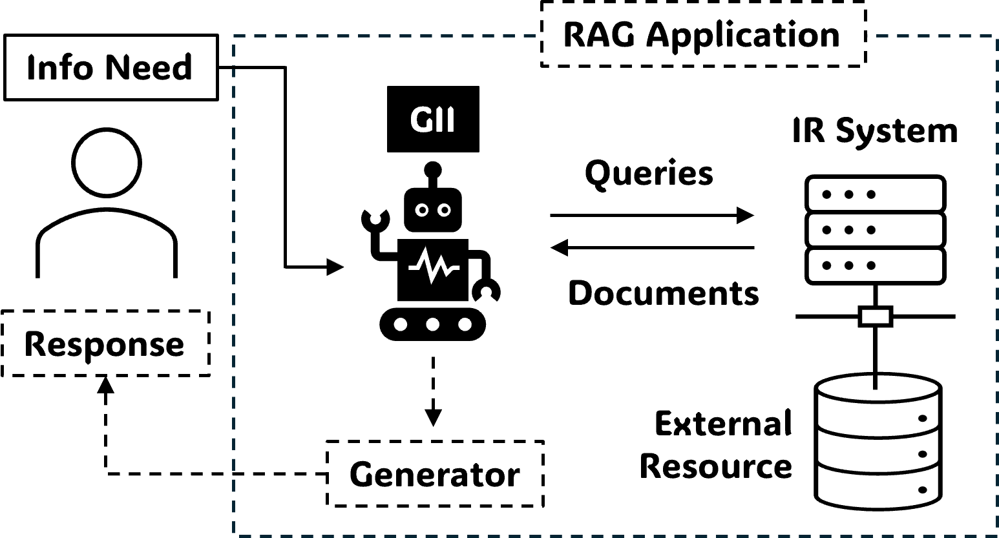
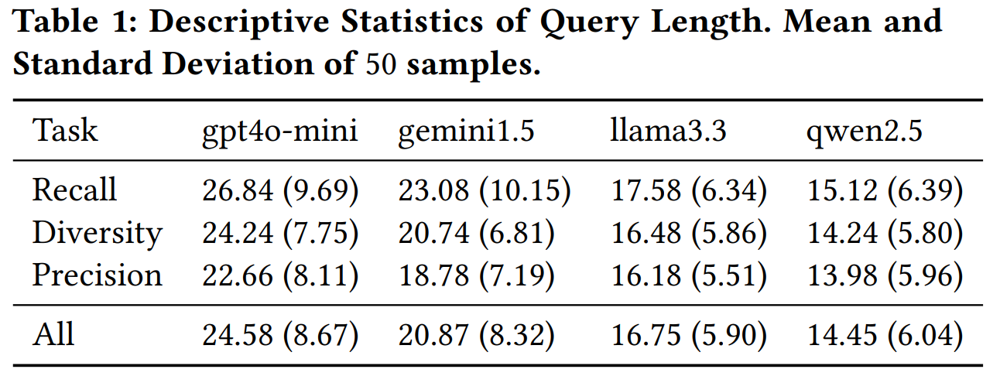
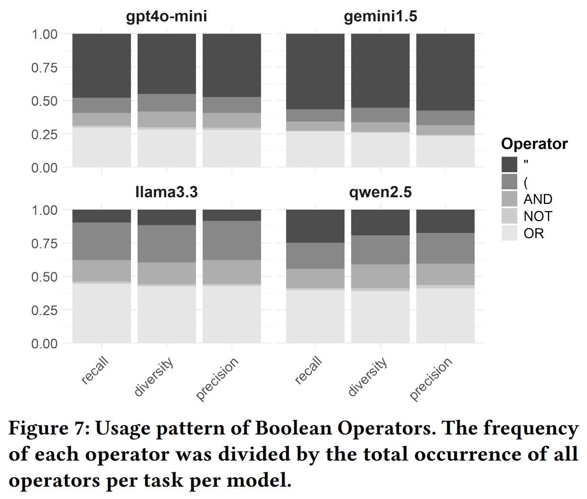
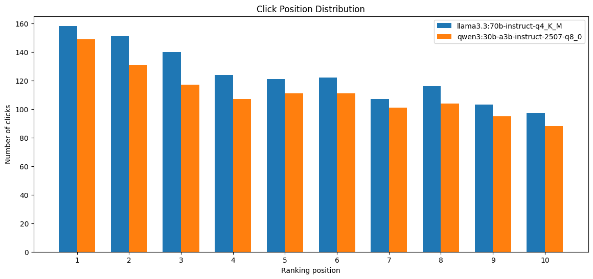

---
hide:
    - toc
---

# Model Search Behaviour

## Architecture (Recap)

{ width=80% }

> Hideo Joho. 2025. Geniie-Lab: A Testbed for Controlled Experimentation of Model Search Behaviour. In Proceedings of the 2025 Annual International ACM SIGIR Conference on Research and Development in Information Retrieval in the Asia Pacific Region (SIGIR-AP 2025), 55–63. [https://doi.org/10.1145/3767695.3769479](https://doi.org/10.1145/3767695.3769479)

## LLMs to study

|Proprietary|Open Weight||
|:--:|:--:|:--:|
|`gpt4o-mini`|`llama 3.3`||
|`gemini 1.5`|`qwen 2.5`|`qwen 3.0`|

## Query Length

{ width=80% }

> Hideo Joho and Joemon M Jose. 2025. An Instruction-Response Perspective on Large Language Models in Information Retrieval Tasks. In Proceedings of the 48th International ACM SIGIR Conference on Research and Development in Information Retrieval (SIGIR '25), 3843–3852. [https://doi.org/10.1145/3726302.3730346](https://doi.org/10.1145/3726302.3730346)

## Boolean Operator Usage

{ width=80% }

> Hideo Joho and Joemon M Jose. 2025. An Instruction-Response Perspective on Large Language Models in Information Retrieval Tasks. In Proceedings of the 48th International ACM SIGIR Conference on Research and Development in Information Retrieval (SIGIR '25), 3843–3852. [https://doi.org/10.1145/3726302.3730346](https://doi.org/10.1145/3726302.3730346)

## Document Selection

{ width=80% }

> Hideo Joho. 2025. Geniie-Lab: A Testbed for Controlled Experimentation of Model Search Behaviour. In Proceedings of the 2025 Annual International ACM SIGIR Conference on Research and Development in Information Retrieval in the Asia Pacific Region (SIGIR-AP 2025), 55–63. [https://doi.org/10.1145/3767695.3769479](https://doi.org/10.1145/3767695.3769479)