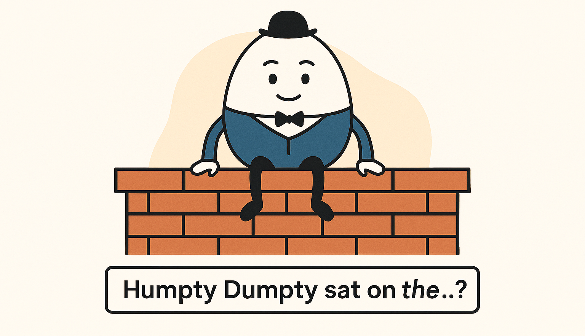
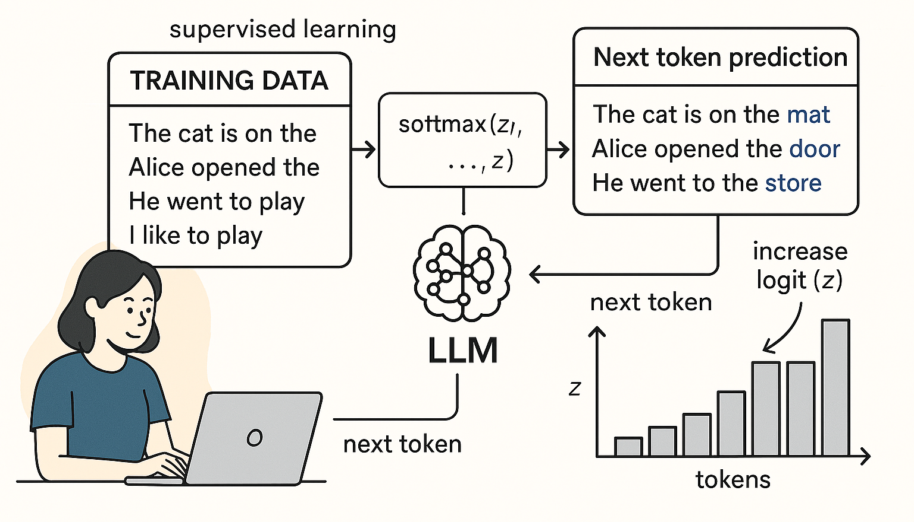
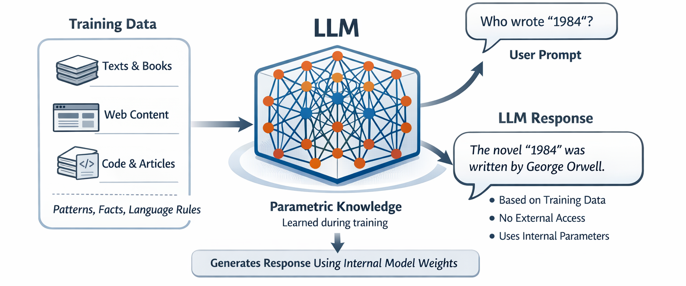
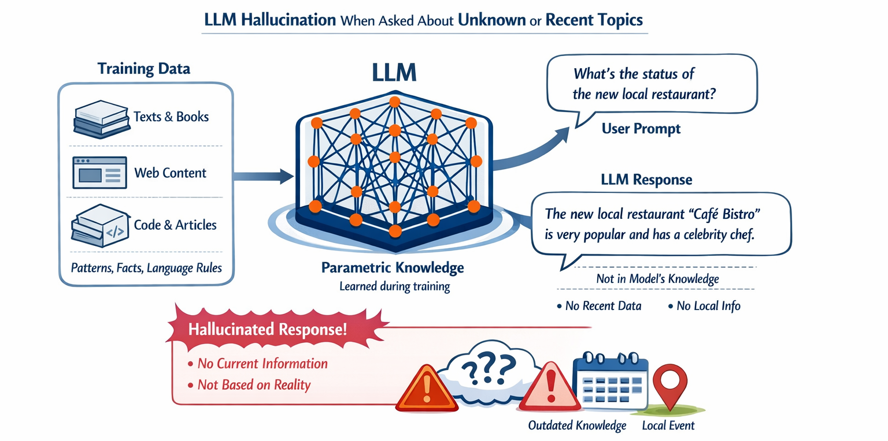

---
hide:
    - toc
---

# Parametric Knowledge and Hallucination

## Quick Quiz

## Next Token Prediction

:bulb: This is only a part of training process.

## Parametric Knowledge (or Memory)

## Hallucination

:bulb: There are many other factors that can cause LLMs to hallucinate.