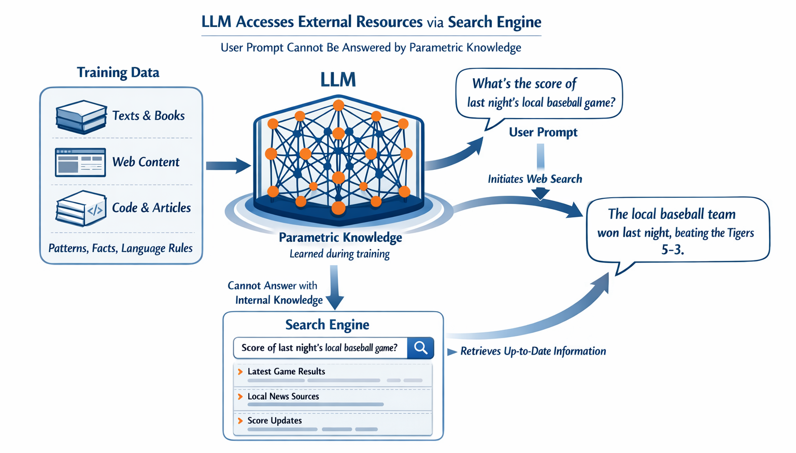
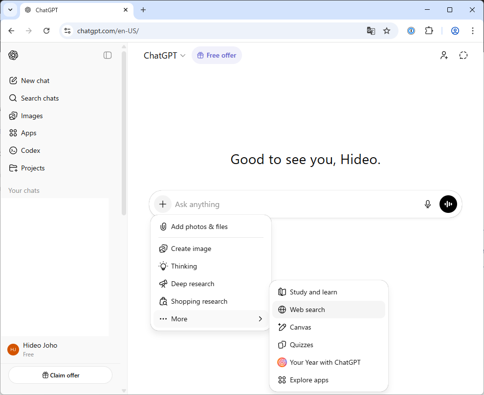
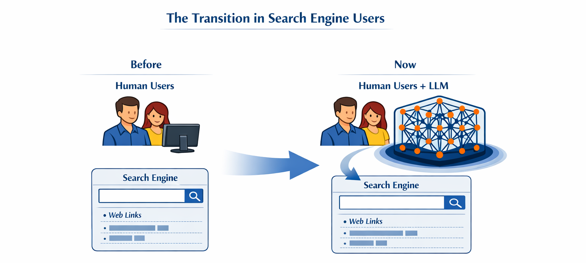
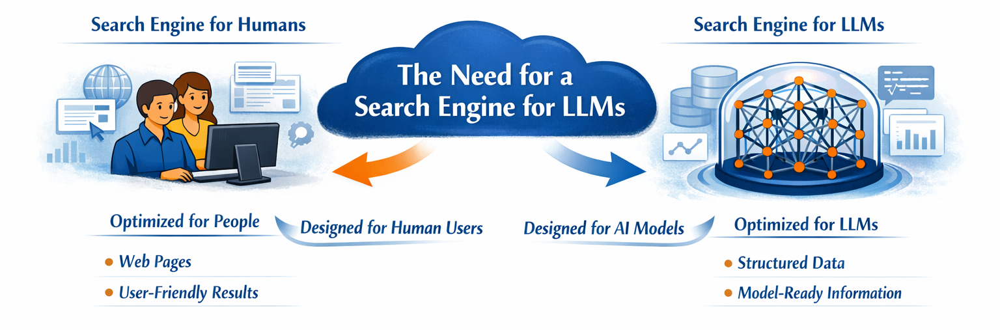

---
hide:
    - toc
---

# Retrieval Augmented Generation (RAG)

## RAG in ChatGPT

{ width=80% }

## Transition of the "users" of search engines

:bulb: Both are black-boxes!

## How do we develop a search engine for LLMs?

