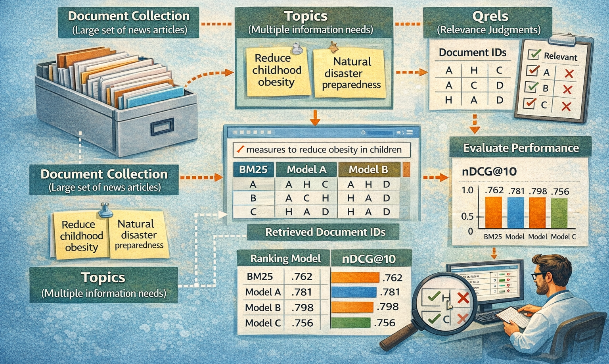

---
hide:
    - toc
---

# Test Collection in Information Retrieval Research



## TREC Robust 2005 Collection

> Voorhees, E. (2006), Overview of the TREC 2005 Robust Retrieval Track, Text Retrieval Conference (TREC), [online], [https://tsapps.nist.gov/publication/get_pdf.cfm?pub_id=150643](https://tsapps.nist.gov/publication/get_pdf.cfm?pub_id=150643) (Accessed February 24, 2026)

=== "Search Topic"

    ```
    TBA
    ```

=== "Sample document"

    ```
    TBA
    ```

=== "Qrel"

    ```
    TBA
    ```

## SciDocs Collection

> Arman Cohan, Sergey Feldman, Iz Beltagy, Doug Downey, and Daniel Weld. 2020. [SPECTER: Document-level Representation Learning using Citation-informed Transformers](https://aclanthology.org/2020.acl-main.207/). In Proceedings of the 58th Annual Meeting of the Association for Computational Linguistics, pages 2270–2282, Online. Association for Computational Linguistics.

=== "Search Topic"

    ```
    TBA
    ```

=== "Sample document"

    ```
    TBA
    ```

=== "Qrel"

    ```
    TBA
    ```