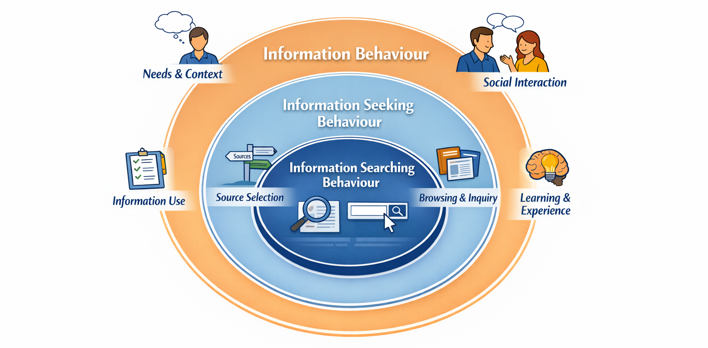

---
hide:
    - toc
---

# Wilson's nested model of information behaviour

> T.D. Wilson, (1999) "Models in information behaviour research", Journal of Documentation, Vol. 55 Issue: 3, pp.249-270. [https://doi.org/10.1108/EUM0000000007145](https://doi.org/10.1108/EUM0000000007145)